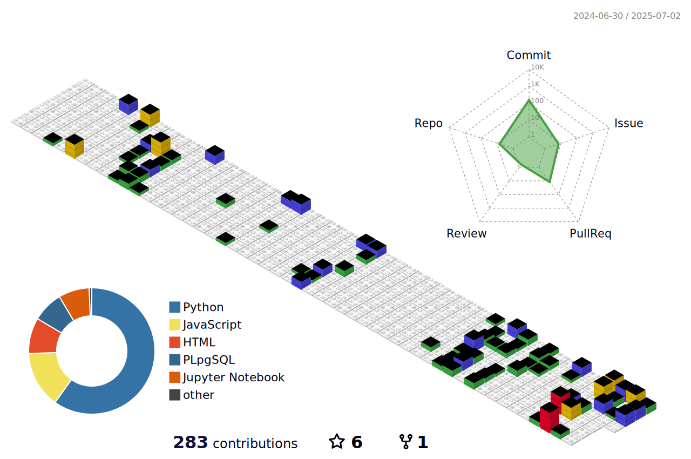

### My name is Cauê, i'm a Florianópolis based analytics professional.
I have worked for the past 3 years in mainly business intelligence projects as a Customer Experience Ops. I have used mainly SQL in a vast ammount of projects, visualizing creating and tuning databases.
I have created automated ETL routines using Python, Deepnote and REST APIs. Currently i am studying Data Engineering, AWS, Airflow and i intend to dive into statistics next.  

---

## Talk to me about 

#### Tech Stack:

#### My Stats

